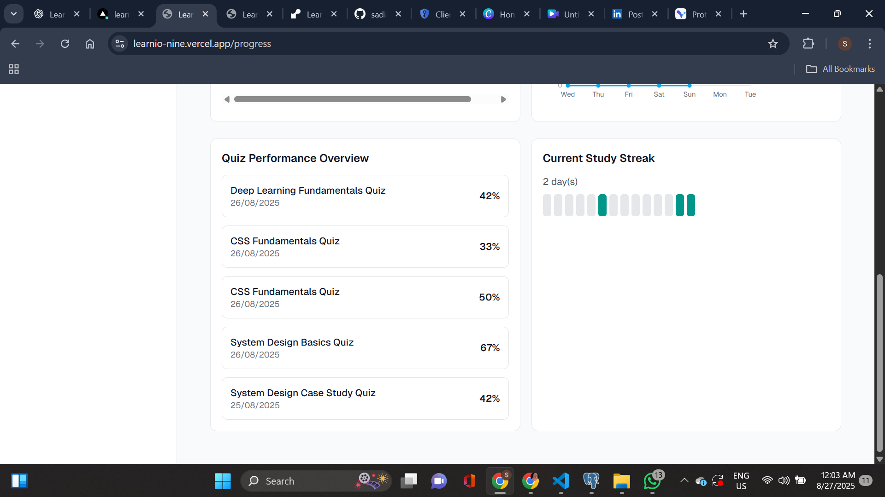

# 📚 LearniO AI  

LearniO AI is a **cloud-hosted SaaS web application** designed to **supercharge learning** with AI-powered goal planning, daily tasks, quizzes, progress tracking, feedback, and email reminders.  

This project is **my own idea** 💡 — I first created a **prototype in Visily AI**, then built the full application using modern web technologies.  
The site is **fully responsive**, so you can plan and track your learning journey on **any device, anytime**.  

---

## ✨ Features  

- **🔑 Authentication**
  - Secure Google Auth login.  

- **🎯 Goal-Oriented Learning**
  - Create learning goals with timelines.  
  - Edit, view, or delete goals easily.  

- **🗓️ AI-Generated Daily Plans**
  - Powered by **Gemini 2.0 Flash API**.  
  - Personalized daily plans and tasks for each goal.  
  - Tasks categorized as **complete, pending, or skipped**.  

- **📝 Interactive Quizzes**
  - Select a task and generate 10–20 task-related quizzes.  
  - Submit answers and get **scores + correct answers instantly**.  

- **📊 Progress Tracking**
  - Visualize task completion stats with completed and skipped tasks, graphs, daily study hours, scores of quizzes and learning streaks.  

- **💡 AI Feedback & Chat**
  - Get insights, recommendations, and personalized feedback from Gemini AI.  
  - Chat with Gemini AI for additional guidance.  

- **⚙️ Customizable Learning Preferences**
  - Adjust preferences in the settings section.  

- **📧 Email Reminders (SMTP Integration)**
  - Automatic email notifications to remind users of upcoming or pending tasks.  
  - Keeps learners on track even when they’re away from the app.  

- **📱 Fully Responsive**
  - Works seamlessly across desktop, tablet, and mobile devices.  

---

## 🛠️ Tech Stack  

- **Frontend**: [Next.js](https://nextjs.org/), [Shadcn UI](https://ui.shadcn.com/), [Tailwind CSS](https://tailwindcss.com/)  
- **Backend**: [Node.js](https://nodejs.org/), [Prisma](https://www.prisma.io/)  
- **Database**: [PostgreSQL](https://www.postgresql.org/)  
- **AI**: [Gemini 2.0 Flash API](https://deepmind.google/technologies/gemini/)  
- **Auth**: Google Auth (NextAuth.js)  
- **Email Reminders**: SMTP integration  

---

## 🚀 Deployment  

- **Frontend**: [Vercel](https://vercel.com/)  
- **Backend**: [Render](https://render.com/)  
- **Database**: [Supabase](https://supabase.com/)  

---

## 🧩 How It Works

1. **Sign in with Google Auth.**
2. **Create a learning goal** with a timeline.
3. **Gemini AI generates daily plans and tasks.**
4. **Track tasks** as complete, pending, or skipped.
5. **Generate and take quizzes** related to your tasks.
6. **Monitor progress graphs** and learning streaks.
7. **Get AI feedback**, insights, and chat support.
8. **Stay on track with email reminders.**
9. **Adjust your learning preferences** anytime.

## The project is deployed here
-- [Use my App](https://learnio-nine.vercel.app/)

---

## 📸 Screenshots

  
  
  
  
  
  
  
  
  
  
  
  
  
  

---

